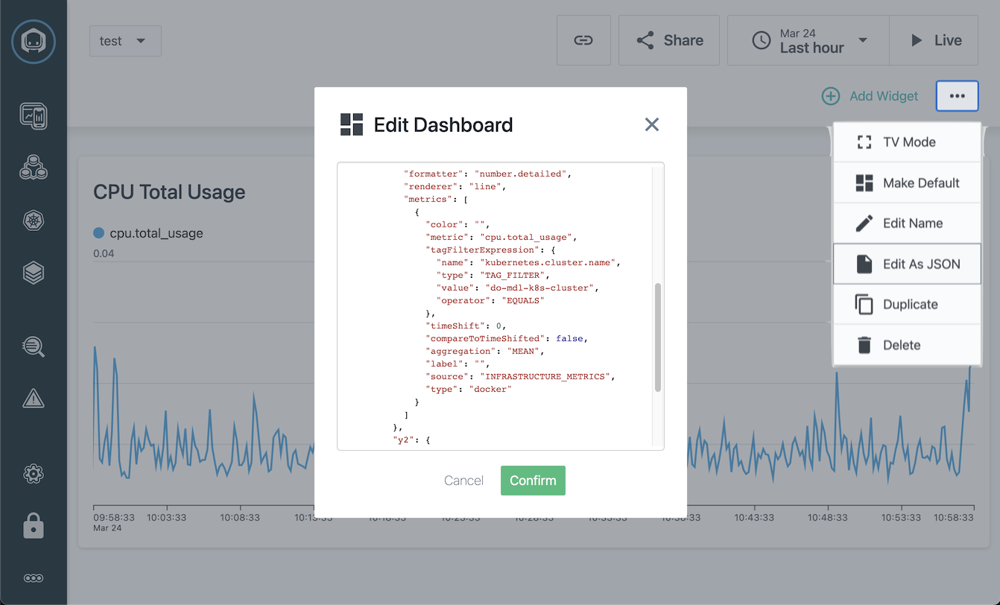

# How to query the new metrics API (Closed Alpha)

Please note that this new API is considered Alpha! The API definition including the endpoint and json structure for both input and output will likely change. Support will only be available on a best effort. Please contact matthias.luebken@instana.com for any questions.   

## Environment Variables

For the examples please set the following Environment variables:

* INSTANA_API_TOKEN
* INSTANA_BASE_URL

## Test Access

To test the access try the following get request:

```
curl --request GET --url $INSTANA_BASE_URL/api/infrastructure-monitoring/catalog/plugins --header "authorization: apiToken $INSTANA_API_TOKEN"
```

## New Metrics Endpoint

The new metrics endpoint is temporarily called `/api/infrastructure-monitoring/explore/groups`. Please change the current value (do-mdl-k8s-cluster) of the `tagFilterExpression` to a Kubernetes cluster in your system.

```
curl --request POST \
--url $INSTANA_BASE_URL/api/infrastructure-monitoring/explore/groups \
--header "authorization: apiToken $INSTANA_API_TOKEN" \
--header 'content-type: application/json' \
--data '{
    "timeFrame":{"to":1616574699723,"windowSize":604800000},
    "type":"docker",
    "tagFilterExpression":{
        "type":"TAG_FILTER",
        "name":"kubernetes.cluster.name",
        "value":"do-mdl-k8s-cluster",
        "operator":"EQUALS"
    },
    "groupBy":["kubernetes.namespace.name"],
    "metrics":[
        {"metric":"cpu.total_usage","aggregation":"P99", "granularity": "3600000"}
    ],
    "pagination":{"retrievalSize":200}
    }' | jq .data
```

## Parameters

Currently the easiest way to determine values for the different is by creating a custom dashboard and copying the values from the JSON definition: 




## Notes

* `groupBy` expects a single value
* Possible values for `metric aggregations` are: MAX, MEAN, MAX, MIN, SUM, P25, P50, P75, P90, P95, P98, P99
* Per default each metric returns a single value over the whole time frame. By specifying a `granularity` in seconds the API returns a time series. 